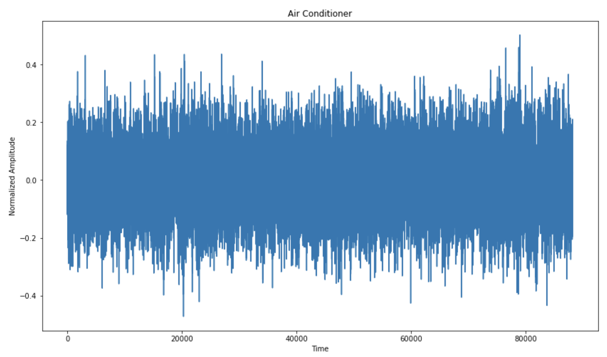
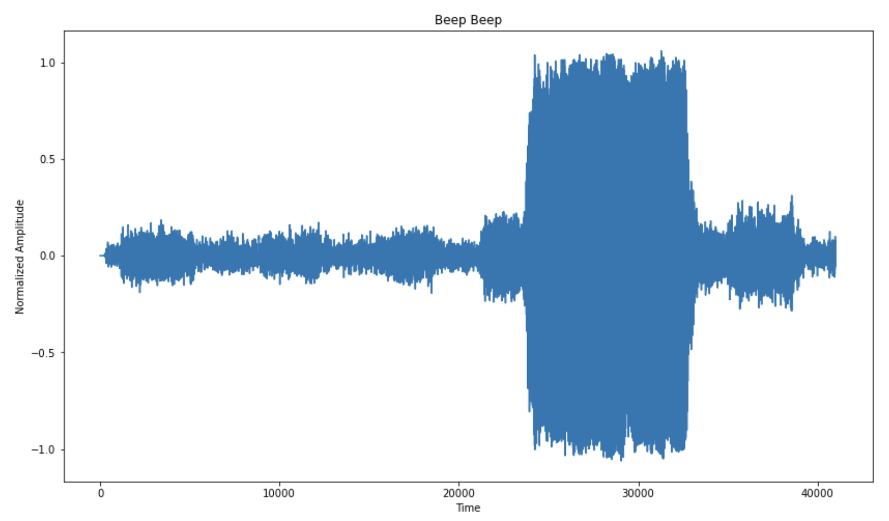
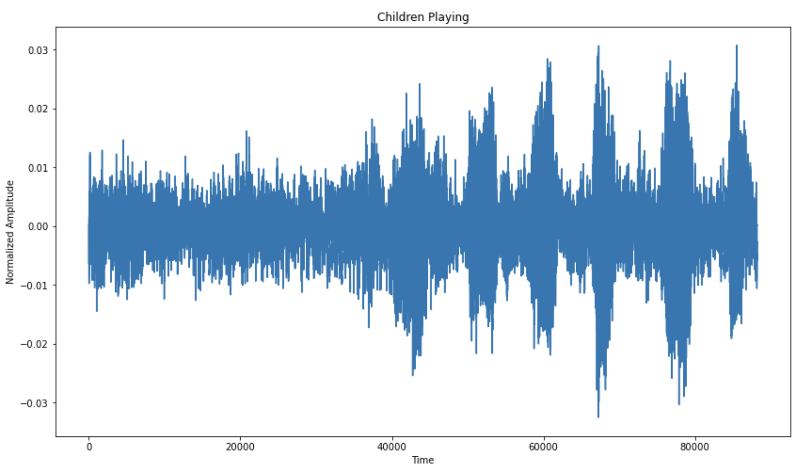
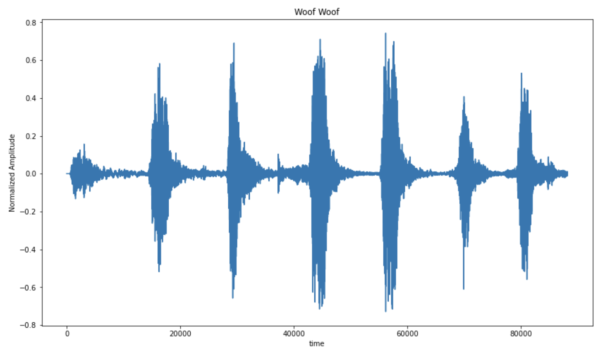
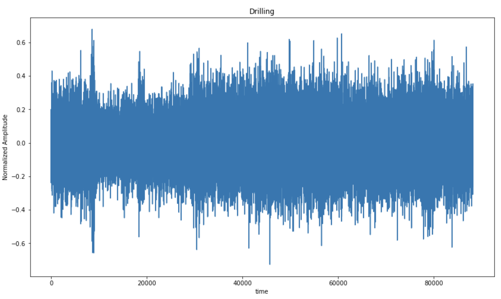
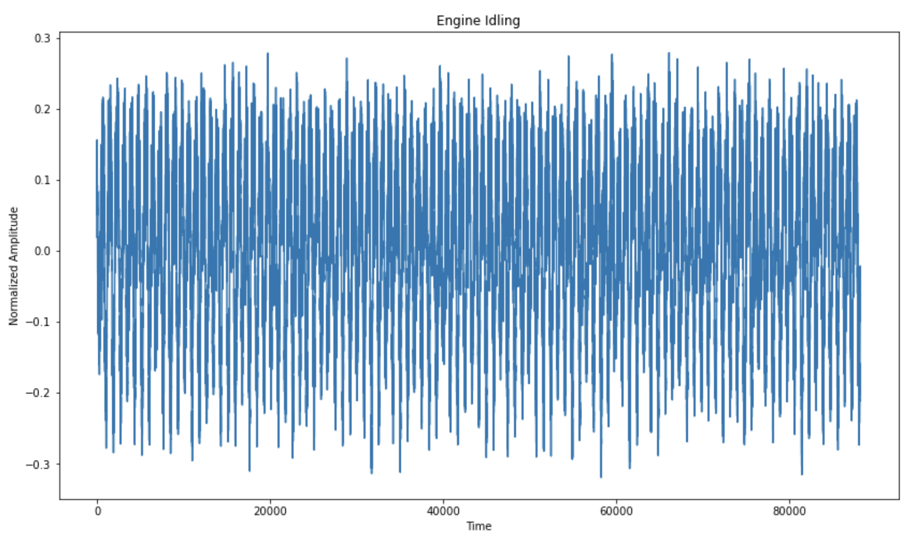
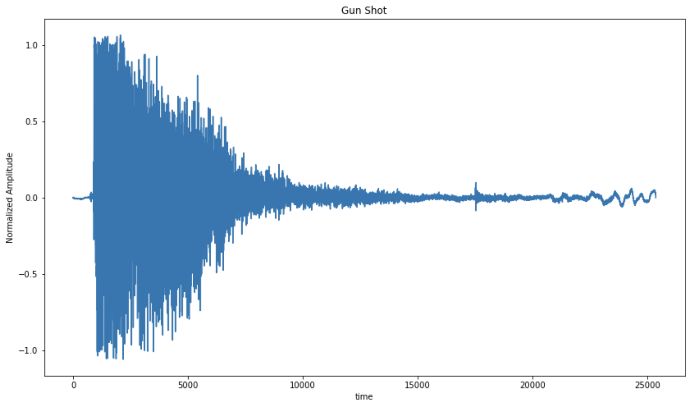
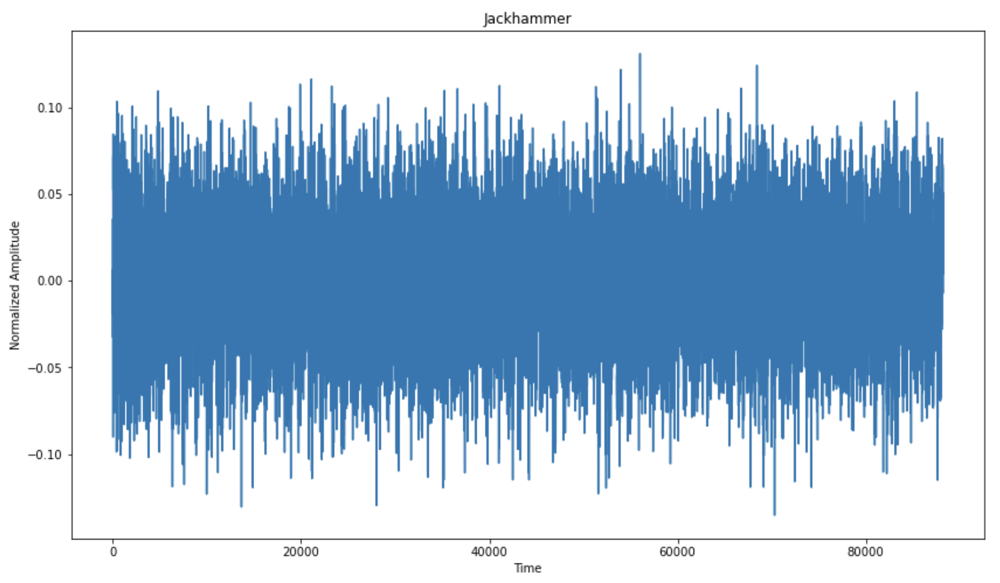
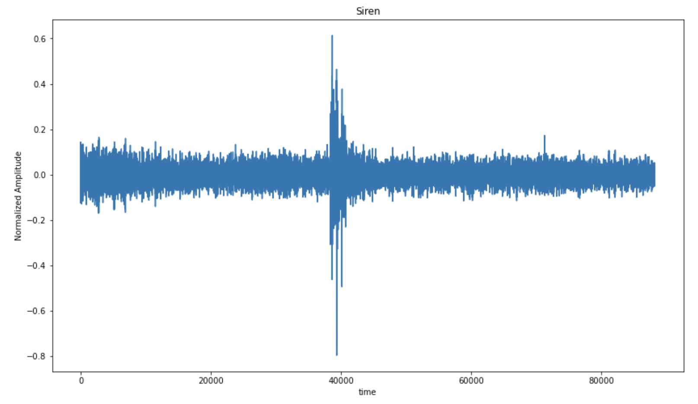
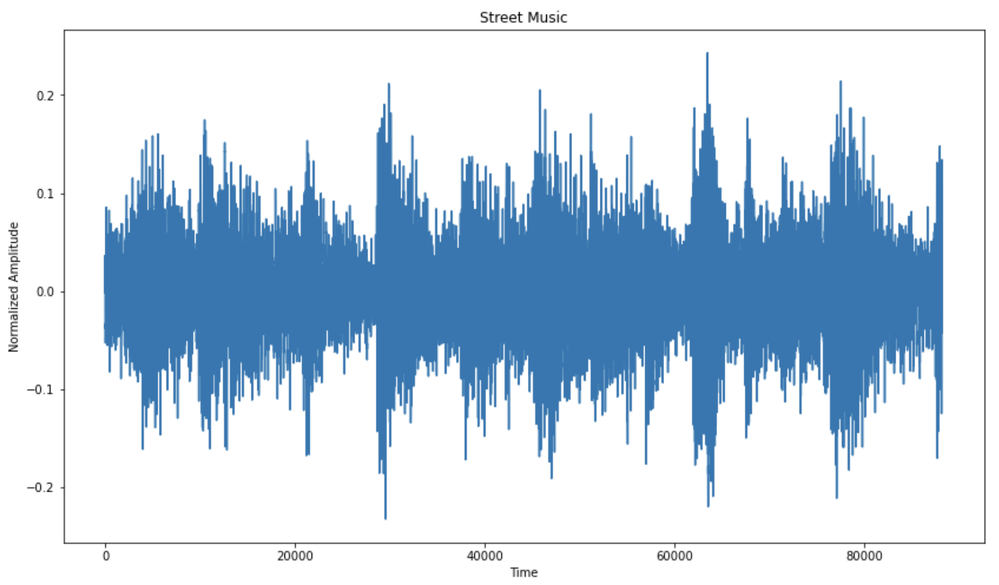

# Urban_sound_classification

# The Data
The data was taken from the UrbanSounds8k dataset. It is composed of 8,723 sound snippets taken from 1297 unique sounds of 10 classes:

0:

1:

2:

3:

4:

5:

6:

7:

8:

9:

## Example Sounds from Each Class

# Features Extracted

# Models Used
- Random Forest

# Feature performance with Random Forest
A random forest trained only on MFCCs achieved an accuracy of 64.84%
This vastly outpreforms all other features, with the next closest features, spectral and chroma, achieving 45% accuracy.

# Where does the model trained on MFCCs fail?
This model is clearly having a rough time differentiating the prolonged, droning sounds of air conditioners, idle engines, car horns (probably accompanined by the drone of traffic), drilling, and jackhammers. Let's see if the introduction of some other features can improve this model!

# Trained on spectral as well
This model does much worse. It still has the same struggles as the MFCCs but now it is doing worse on the sounds like gunshots and dog barks that the other model was doing great at identifying.

# Let's investigate some actual sounds

It sounds like the air conditioner is usually more of a constant drone than the idle engine or the jackhammer. Maybe if we implemented a feature that can pick up on the key or sustained frequency of the sounds we would get a better answer. We are kind of doing this with chroma_stft, but let's try tonnetz and see if we get anything different.

# Final Model
## 50 MFCCs, ZCR, Chroma STFT, Spectral Contrast

The last model was so close to 70% - I had to find one a feature to push it over the top.

# Next Steps

It's clear that audio signals with dense frequency plots are giving the model the most trouble. I want to try and tackle this problem in two ways:
1 - Using a Neural Net to predict classes. Training over 10 folds will take some time but could yield interesting results.

2 - Implement a noise reduction method. Sounds like air conditioners have low variability and a feature could be designed to compare the energy of pre and post noise cancelled signals.

